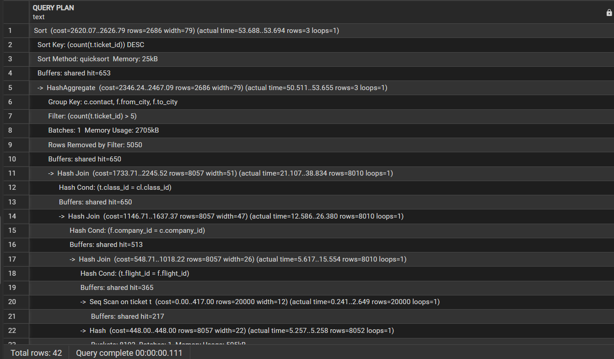
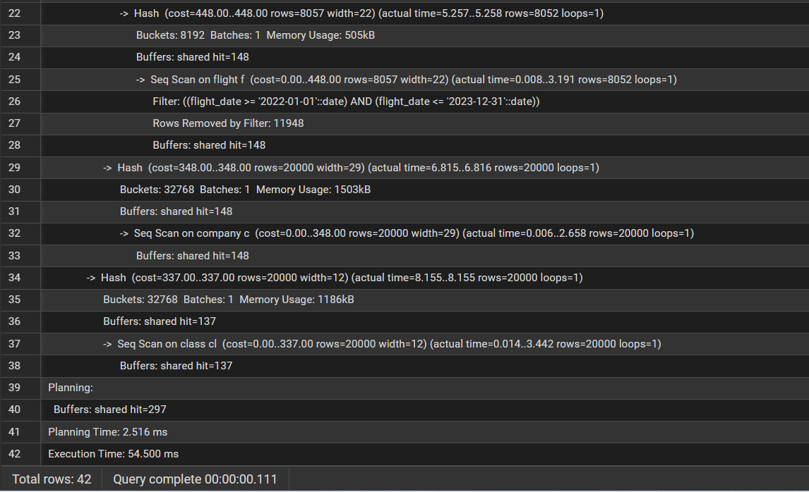
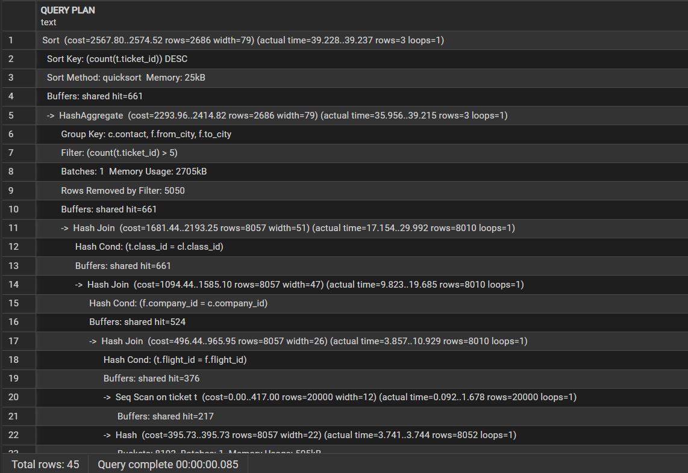
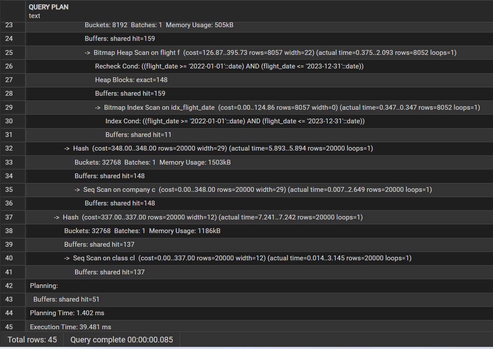

# Лабораторная работа 4. Анализ производительности
## Цель: Освоение методов анализа и оптимизации производительности БД.
## Генерируем 20000 записей в каждой таблице:
```sql
INSERT INTO shishkov_02272.class (class_id, name, price)
SELECT
    i,
    'Class_' || i,
    round((random() * 50000 + 5000)::numeric, 2)
FROM generate_series(1, 20000) AS g(i);

INSERT INTO shishkov_02272.company (company_id, contact)
SELECT
    i,
    'contact_' || i || '@airline.com'
FROM generate_series(1, 20000) AS g(i);

INSERT INTO shishkov_02272.flight
(flight_id, company_id, flight_date, from_city, to_city)
SELECT
    i,
    (random() * 19999 + 1)::int,
    date '2020-01-01' + (random() * 1825)::int,
    'City_' || (random() * 50)::int,
    'City_' || (random() * 50)::int
FROM generate_series(1, 20000) AS g(i);

INSERT INTO shishkov_02272.passenger
(passenger_id, name, surname, date_of_birth)
SELECT
    i,
    'Name_' || i,
    'Surname_' || i,
    date '1950-01-01' + (random() * 20000)::int
FROM generate_series(1, 20000) AS g(i);

INSERT INTO shishkov_02272.ticket
(ticket_id, passenger_id, flight_id, class_id)
SELECT
    i,
    (random() * 19999 + 1)::int,
    (random() * 19999 + 1)::int,
    (random() * 19999 + 1)::int
FROM generate_series(1, 20000) AS g(i);
```
## Анализ выполнения запросов через EXPLAIN ANALYZE (выбирает перелёты за период, считает количество билетов, вычисляет среднюю цену, сортирует по популярности рейса):
```sql
EXPLAIN (ANALYZE, BUFFERS)
SELECT
    c.contact,
    f.from_city,
    f.to_city,
    COUNT(t.ticket_id),
    AVG(cl.price)
FROM shishkov_02272.ticket t
JOIN shishkov_02272.flight f ON t.flight_id = f.flight_id
JOIN shishkov_02272.company c ON f.company_id = c.company_id
JOIN shishkov_02272.class cl ON t.class_id = cl.class_id
WHERE f.flight_date BETWEEN '2022-01-01' AND '2023-12-31'
GROUP BY c.contact, f.from_city, f.to_city
HAVING COUNT(t.ticket_id) > 5
ORDER BY COUNT(t.ticket_id) DESC;
```
## Создание индексов для оптимизации БД:
```sql
-- Для фильтрации по дате
CREATE INDEX idx_flight_date
ON shishkov_02272.flight (flight_date);
-- Для соединений
CREATE INDEX idx_ticket_flight_id
ON shishkov_02272.ticket (flight_id);
CREATE INDEX idx_ticket_class_id
ON shishkov_02272.ticket (class_id);
CREATE INDEX idx_flight_company_id
ON shishkov_02272.flight (company_id);
```
## Удаление индексов (для удобства, чтобы можно было сравнить анализ без них еще раз)
```sql
DROP INDEX IF EXISTS shishkov_02272.idx_flight_date;
DROP INDEX IF EXISTS shishkov_02272.idx_ticket_flight_id;
DROP INDEX IF EXISTS shishkov_02272.idx_ticket_class_id;
DROP INDEX IF EXISTS shishkov_02272.idx_flight_company_id;
```
## Анализ работы программы до создания индексов - выполнение запроса составило 54 мс


## План:
* Используются Seq Scan (последовательное сканирование)
* Большое количество Buffers: shared read
* JOIN выполняется через Hash Join
* Высокое время выполнения из-за отсутствия индексов
* Фильтрация по flight_date не оптимизирована
## Анализ работы после создания индексов - выполнение запроса составило 39 мс - оптимизация успешна


##  Выводы 
* Индексы значительно ускоряют выполнение запросов с фильтрацией и JOIN
* B-tree индексы подходят для условий сравнения
* При больших объёмах данных индексация критически важна
* Индексы увеличивают стоимость операций INSERT, но ускоряют SELECT
* Оптимизация особенно эффективна для аналитических запросов
